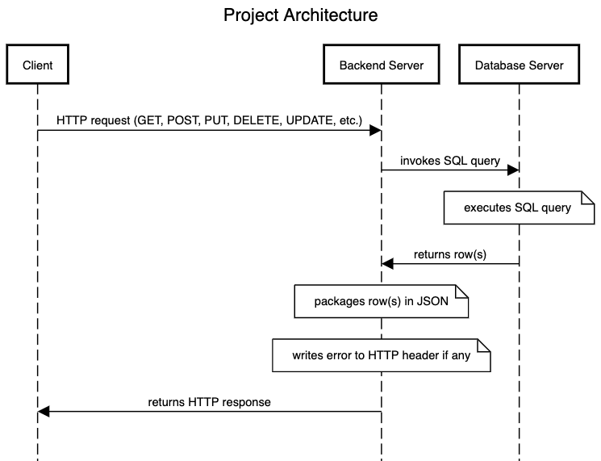
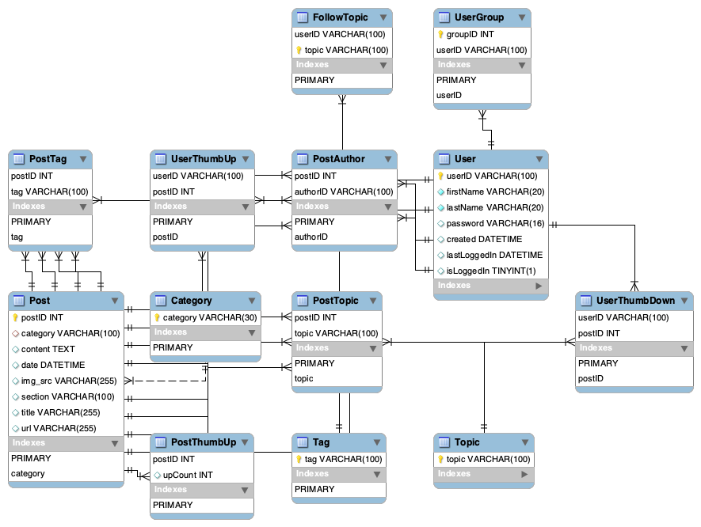

# A Rudimentary Blogging App
## Background
The project was originally dedicated for the database systems course, but I had a lot of fun learning how to implement the client-server architecture (though not perfect). 

My project is based on the data on the [TechCrunch Posts Compilation](https://www.kaggle.com/thibalbo/techcrunch-posts-compilation) dataset on Kaggle. With some
transformations and re-purposing of the data, the data can be used in a social-network-or-blog-post-hybrid application. The raw csv file has the schema (authors, category, content, date, id, img_src, section, tags, title, topics, url).

Automating the process of inserting huge amounts of data from .csv files into databases helps me realize the importance and boons of having the ability to create toolings for myself or others. 

### 1. High-level Architecture
This section illustrates the high-level architecture of the project including the database server, the backend server and API, and the client. Below is a web-sequence diagram that illustrates the architecture:


#### 1.1 Database Server
The database server is hosted on an AWS EC2 instance (`t2.micro`) running Ubuntu 18.04. It is implemented using `innoDB` engine in MySQL. Please note that after the submission of the project, the instance will be shut down to avoid excessive cost. The database server stores the data that has been specified in Part 2 and 3 of this project.

The data model is shown in the ER relationship diagram below:


#### 1.2 Backend Server and API
The backend server and API are implemented in Go. It can be compiled and deployed on a host running on any mainstream operating systems. For the purpose of this project, it is running on my MacBook. The source code is in the folder "medium_mysql_server". 

Once the server starts, it connects to the database server, listens to `http://127.0.0.1:8080`, registers a number of routes, and handles any client requests:
```go
/*
In ./server.server.go
*/
// RegisterServer creates a new server with an API to interact with database and a router.
func RegisterServer() *Server {
	server := &Server{api: api.NewAPI(), router: mux.NewRouter()}
	server.registerRoutes()
	return server
}

// Listen listens to 127.0.0.1:8080 for incoming requests.
func (server *Server) Listen() {
	log.Printf("Starting Listening on port [%d]...\n", 8080)
	http.ListenAndServe("127.0.0.1:8080", server.router)
}

func (server *Server) registerRoutes() {
	server.router.HandleFunc("/posts", server.GetPostsHandler)
	// GET: UserGroups
	server.router.HandleFunc("/groups", server.GetGroupsHandler)
	// GET: PostAuthors
	server.router.HandleFunc("/authors", server.GetPostAuthorHandler)
	// GET: FollowedTopics
	server.router.HandleFunc("/users/{userId}/topics", server.GetFollowedTopicsHandler)
    // ... more routes ...
}

/*
In main.go (entry point)
*/
func main() {
	server := server.RegisterServer()
	server.Listen()
}
```

The `type Server struct{}` has an `type API struct{}` that connects to the DB server and performs SQL queries depending on the routes. For example, if the route is `http://127.0.0.1:8080/users/<user_id>/topics` and the HTTP method is `GET`, `GetFollowedTopicsHandler` will be invoked:
```go
/* In server/handler.go */
// GetFollowedTopicsHandler returns the topics the user follows.
func (server *Server) GetFollowedTopicsHandler(w http.ResponseWriter, r *http.Request) {
	if !server.checkMethod(&w, r, http.MethodGet) {
		return
	}

	userId := mux.Vars(r)["userId"]
	topicsJSON, jsonErr := server.api.GetFollowedTopics(userId)
	if jsonErr != nil {
		log.Println(jsonErr.Error())
	}
	w.Header().Set("Content-Type", "application/json")
	w.WriteHeader(http.StatusOK)
	w.Write(topicsJSON)
}
```
The server utilizes its API, which performs the SQL query and returns the rows in `json` format, to return results back to the user:
```go
/* In api/api_post.go */
// GetFollowedTopics retrieves all the topics the user follows.
func (api *API) GetFollowedTopics(userId string) ([]byte, error) {
	q := fmt.Sprintf(`select topic from FollowTopic where userID='%s';`, userId)
	rows := api.executeQuery(q)

	topics := make([]string, 0)
	var topic string
	for rows.Next() {
		if err := rows.Scan(&topic); err == nil {
			topics = append(topics, topic)
		} else {
			log.Println(err.Error())
		}
	}
	defer rows.Close()
	return json.Marshal(topics)
}
```
Other types of requests such as `POST`, `UPDATE`, `PUT`, etc. are handled in similar fashions. 

### 1.3 Client
The client is implemented in Python, and it is a rudimentary command-line interface. It allows new users to sign up, log in, and after logging in:
* get posts of the topics the user follows since he/she last logged in
* join an existing group
* create a new group
* get all posts
* write a post

The client will send corresponding HTTP requests to `http://127.0.0.1:8080`, which will be picked up by the server. 

### 2. How to run the project?
#### 2.1 Server
##### Requirements
1. [Gorrila Mux](https://github.com/gorilla/mux)
2. [AWS SDK for the Go programming language.](https://github.com/aws/aws-sdk-go)
3. [Go MySQL Driver](https://github.com/Go-SQL-Driver/MySQL/)
Copy folder `backend` to your `GOPATH`. Within `backend`, run the following to start the server:
```zsh
go run .
```

#### 2.2 Client
###### Requirements
1. [Requests: HTTP for Humans](https://2.python-requests.org/en/master/)
Within folder `client`, run the following to start the client:
```zsh
python3 main.py
```

### Contributor
[Yiren](https://www.github.com/yirzhou)
